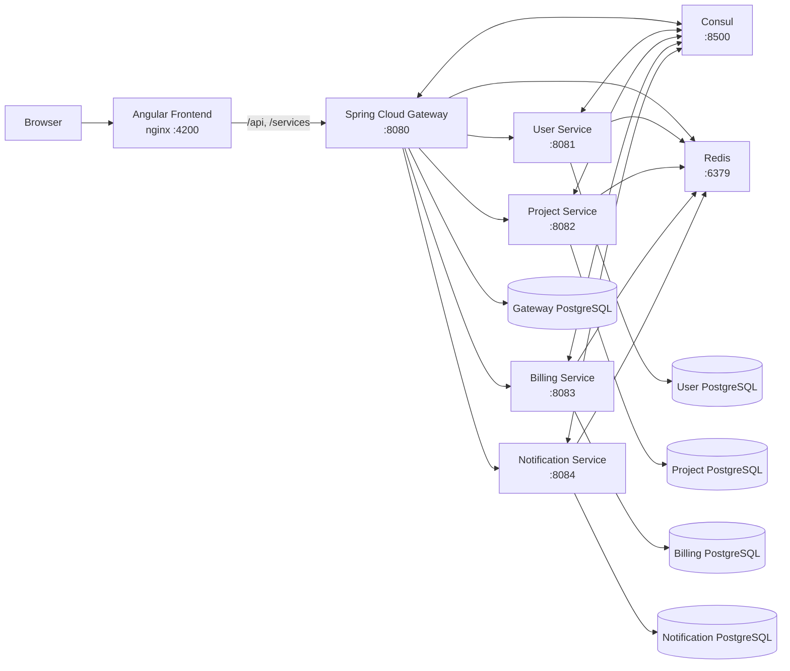

# NexaFlow Platform

NexaFlow is a workspace-oriented SaaS platform for organizing teams, projects, tasks, subscriptions, and notifications. The platform uses a JHipster-based microservices architecture with an Angular frontend, Spring Boot services, Consul service discovery, PostgreSQL databases, Redis, and Docker Compose orchestration.

The repository is a monorepo: every backend service remains independently buildable and owns its database, while the root-level Docker Compose configuration provides a complete local environment.

## Contents

- [Platform capabilities](#platform-capabilities)
- [Architecture](#architecture)
- [Technology stack](#technology-stack)
- [Repository structure](#repository-structure)
- [Services and ports](#services-and-ports)
- [Quick start with Docker](#quick-start-with-docker)
- [Configuration](#configuration)
- [Authentication and authorization](#authentication-and-authorization)
- [Data ownership and persistence](#data-ownership-and-persistence)
- [Local development](#local-development)
- [Testing and quality checks](#testing-and-quality-checks)
- [API conventions](#api-conventions)
- [Useful Docker commands](#useful-docker-commands)
- [Troubleshooting](#troubleshooting)
- [Production considerations](#production-considerations)

## Platform Capabilities

NexaFlow currently provides:

- Account registration, activation, login, password reset, and JWT authentication
- Workspace and organization management
- Workspace membership and role management
- Invitation creation, acceptance, rejection, and revocation
- Project creation, editing, completion, archiving, and restoration
- Task creation, assignment, status management, priorities, due dates, and comments
- Project and task activity logs
- Dashboard summaries, project status metrics, task completion metrics, and personal task views
- Subscription plan selection, activation, cancellation, and usage reporting
- User-specific notifications, unread counts, read state, and notification navigation
- Paginated project, task, notification, administration, and generated CRUD APIs
- Consul-based service discovery and gateway routing

## Architecture



### Request Flow

1. The browser loads the standalone Angular application from nginx on port `4200`.
2. nginx proxies API and service requests to the gateway.
3. The gateway authenticates JWT bearer tokens and routes service requests using Consul discovery.
4. Each microservice validates the same JWT and applies its own authorization rules.
5. Organization-scoped frontend requests include `X-Organization-Id`.
6. Every service reads and writes only its own PostgreSQL database.
7. Internal service-to-service endpoints are protected with a shared internal API token.

## Technology Stack

### Frontend

- Angular 21
- TypeScript 5
- PrimeNG and PrimeIcons
- Bootstrap and ng-bootstrap
- Chart.js
- RxJS
- nginx production image

### Backend

- Java 21
- Spring Boot
- Spring Security and OAuth2 Resource Server JWT support
- Spring Cloud Gateway
- Spring Cloud Consul
- Spring Data R2DBC in the gateway
- Spring Data JPA in the microservices
- Liquibase database migrations
- Maven Wrapper
- JHipster 9-generated foundations

### Infrastructure

- Docker and Docker Compose
- PostgreSQL 16
- Redis 7
- HashiCorp Consul

## Repository Structure

```text
nexaflow-platform/
├── frontend/                 Angular application and nginx image
├── gateway/                  Authentication, accounts, admin APIs, API gateway
├── user-service/             Workspaces, memberships, and invitations
├── project-service/          Projects, tasks, comments, activity, dashboard
├── billing-service/          Plans, subscriptions, and usage limits
├── notification-service/     User and system notifications
├── docs/                     Architecture and roadmap documents
├── docker-compose.yml        Complete local platform orchestration
├── .env.example              Environment variable template
└── README.md
```

Each Java application contains its own:

- `pom.xml` and Maven Wrapper
- Spring configuration
- Liquibase changelogs
- tests
- generated service-level Docker configuration
- production Dockerfile

## Services and Ports

### Applications

| Component            | Compose service        | Host port | Responsibility                                    |
| -------------------- | ---------------------- | --------: | ------------------------------------------------- |
| Frontend             | `frontend`             |    `4200` | Angular application served by nginx               |
| Gateway              | `gateway`              |    `8080` | Authentication, accounts, administration, routing |
| User Service         | `user-service`         |    `8081` | Workspaces, memberships, invitations              |
| Project Service      | `project-service`      |    `8082` | Projects, tasks, comments, activity, dashboard    |
| Billing Service      | `billing-service`      |    `8083` | Plans, subscriptions, usage                       |
| Notification Service | `notification-service` |    `8084` | Notifications and unread state                    |
| Consul               | `consul`               |    `8500` | Service discovery and Consul UI                   |
| Redis                | `redis`                |    `6379` | Shared caching/runtime infrastructure             |

### Databases

| Database             | Compose service         | Host port | Database name         | User       |
| -------------------- | ----------------------- | --------: | --------------------- | ---------- |
| Gateway              | `gateway-postgres`      |    `5432` | `nexaflow`            | `nexaflow` |
| User Service         | `user-postgres`         |    `5434` | `userservice`         | `nexaflow` |
| Project Service      | `project-postgres`      |    `5435` | `projectservice`      | `nexaflow` |
| Billing Service      | `billing-postgres`      |    `5436` | `billingservice`      | `nexaflow` |
| Notification Service | `notification-postgres` |    `5437` | `notificationservice` | `nexaflow` |

Host ports are intended for local development. They should not be exposed publicly in a production deployment.

## Quick Start With Docker

### Prerequisites

- Docker Desktop or Docker Engine with Docker Compose v2
- At least 8 GB of available memory is recommended for building and running the complete stack
- Git

Java and Node.js are not required when the entire platform is run through Docker.

### 1. Clone the Repository

```bash
git clone https://github.com/denis2224-dev/NexaFlow.git
cd NexaFlow
```

### 2. Create Local Environment Configuration

```bash
cp .env.example .env
```

Generate secure local values:

```bash
openssl rand -base64 64
openssl rand -base64 32
```

Use the first value for `JHIPSTER_SECURITY_AUTHENTICATION_JWT_BASE64_SECRET` and the second for `APPLICATION_INTERNAL_API_TOKEN`. Set a database password for each service.

Example structure:

```dotenv
JHIPSTER_SECURITY_AUTHENTICATION_JWT_BASE64_SECRET=<base64-secret>
APPLICATION_INTERNAL_API_TOKEN=<internal-service-token>

GATEWAY_DB_PASSWORD=<gateway-database-password>
USER_SERVICE_DB_PASSWORD=<user-database-password>
PROJECT_SERVICE_DB_PASSWORD=<project-database-password>
BILLING_SERVICE_DB_PASSWORD=<billing-database-password>
NOTIFICATION_SERVICE_DB_PASSWORD=<notification-database-password>
```

Do not commit `.env`. It is intentionally ignored by Git.

### 3. Build and Start the Platform

```bash
docker compose up --build -d
```

The initial build downloads Node, Maven, and container dependencies and may take several minutes.

### 4. Verify Container Health

```bash
docker compose ps
```

All application, database, Consul, Redis, and frontend containers should eventually report `healthy`.

Useful checks:

```bash
curl http://localhost:8080/management/health
curl -I http://localhost:4200/
```

### 5. Open the Application

- Application: [http://localhost:4200](http://localhost:4200)
- Gateway health: [http://localhost:8080/management/health](http://localhost:8080/management/health)
- Consul UI: [http://localhost:8500](http://localhost:8500)

The frontend is served on port `4200`. Port `8080` is the backend gateway and is not the primary browser entry point.

### Development Seed Accounts

The gateway Liquibase baseline includes the standard local JHipster accounts:

| Login   | Password | Role          |
| ------- | -------- | ------------- |
| `admin` | `admin`  | Administrator |
| `user`  | `user`   | Standard user |

These credentials are for local development only and must not be used in production.

## Configuration

### Required Variables

| Variable                                             | Purpose                                                      |
| ---------------------------------------------------- | ------------------------------------------------------------ |
| `JHIPSTER_SECURITY_AUTHENTICATION_JWT_BASE64_SECRET` | Shared signing key used by the gateway and all microservices |
| `APPLICATION_INTERNAL_API_TOKEN`                     | Protects internal service-to-service endpoints               |
| `GATEWAY_DB_PASSWORD`                                | Gateway PostgreSQL password                                  |
| `USER_SERVICE_DB_PASSWORD`                           | User-service PostgreSQL password                             |
| `PROJECT_SERVICE_DB_PASSWORD`                        | Project-service PostgreSQL password                          |
| `BILLING_SERVICE_DB_PASSWORD`                        | Billing-service PostgreSQL password                          |
| `NOTIFICATION_SERVICE_DB_PASSWORD`                   | Notification-service PostgreSQL password                     |

### Optional Tooling Variables

The template also contains optional values for TLS, Sonar, JHipster Control Center, and Grafana:

```dotenv
JHIPSTER_CONTROL_CENTER_PASSWORD=
GRAFANA_ADMIN_PASSWORD=
SERVER_SSL_KEY_STORE_PASSWORD=
SONAR_LOGIN=
SONAR_PASSWORD=
```

### Shared Secret Rules

- The gateway and every microservice must use the same JWT signing secret.
- Services that call internal APIs must use the same internal API token.
- Use different database passwords per service outside local development.
- Changing a PostgreSQL password in `.env` does not automatically change the password inside an already initialized volume. Update the database role or recreate the local volume when appropriate.

## Authentication and Authorization

NexaFlow currently uses first-party username/password authentication with stateless JWT bearer tokens.

### Authentication Flow

1. The frontend sends credentials to `POST /api/authenticate`.
2. The gateway validates the user against its local account database.
3. The gateway signs and returns a JWT.
4. The frontend stores the token in session or local storage, depending on the remember-me setting.
5. The token is attached to authenticated API requests.
6. The gateway and microservices validate the shared JWT signature.

### Authorization

- Gateway administration APIs require `ROLE_ADMIN`.
- Workspace operations enforce owner, administrator, and member role boundaries.
- Organization-scoped requests use the `X-Organization-Id` header.
- Microservice resource APIs are authenticated.
- Internal endpoints under `/api/internal/**` require the internal API token.

OIDC is not currently enabled. The existing gateway can be extended with an external OIDC provider while retaining local application user records for memberships, task assignment, and audit data.

## Data Ownership and Persistence

NexaFlow follows a database-per-service model.

| Service              | Primary data                                                   |
| -------------------- | -------------------------------------------------------------- |
| Gateway              | Users, authorities, account activation and password-reset data |
| User Service         | Organizations, memberships, invitations                        |
| Project Service      | Projects, tasks, comments, activity logs                       |
| Billing Service      | Plans and subscriptions                                        |
| Notification Service | Notifications and read state                                   |

### Docker Volumes

Compose persists PostgreSQL data in named volumes:

```text
nexaflow-platform_gateway-postgres-data
nexaflow-platform_user-postgres-data
nexaflow-platform_project-postgres-data
nexaflow-platform_billing-postgres-data
nexaflow-platform_notification-postgres-data
```

Stopping containers does not delete these volumes:

```bash
docker compose down
```

The following command is destructive and deletes all Compose-managed database data:

```bash
docker compose down -v
```

Create verified backups before deleting or replacing volumes.

### Liquibase and Sample Data

Database schemas are managed by Liquibase during application startup.

The root Compose stack runs services with:

```text
SPRING_PROFILES_ACTIVE=prod,api-docs
```

The production Liquibase context does not load most generated `faker` sample rows. Empty domain tables after a fresh startup are therefore expected. The gateway still creates its baseline users and authorities, and the billing service includes its configured plan data.

## Local Development

### Prerequisites

- Java 21
- Node.js `24.16.0` or newer
- npm
- Docker

### Frontend Development

Install dependencies:

```bash
cd frontend
npm ci
```

Start the Angular development server:

```bash
npm run start
```

The development frontend is available at [http://localhost:4200](http://localhost:4200).

Build the production frontend:

```bash
npm run build
```

Other useful commands:

```bash
npm run lint
npm run test
npm run prettier:check
```

### Backend Development

Each backend application can be built independently:

```bash
cd gateway
./mvnw
```

```bash
cd user-service
./mvnw
```

```bash
cd project-service
./mvnw
```

```bash
cd billing-service
./mvnw
```

```bash
cd notification-service
./mvnw
```

The generated service-level Compose files under each service's `src/main/docker/` directory can start that service's development dependencies. Do not start multiple service-local Consul stacks simultaneously on the same host ports. For complete platform integration, the root Compose stack is the recommended workflow.

### Rebuild One Docker Service

```bash
docker compose up -d --build --force-recreate frontend
docker compose up -d --build --force-recreate gateway
docker compose up -d --build --force-recreate project-service
```

To bypass Docker's build cache:

```bash
docker compose build --no-cache frontend
docker compose up -d --force-recreate frontend
```

## Testing and Quality Checks

### Java Services

Run tests inside a service:

```bash
./mvnw test
```

Run the complete Maven verification lifecycle:

```bash
./mvnw verify
```

Build a production package without tests:

```bash
./mvnw -Pprod -DskipTests package
```

The Dockerfiles use the last command to keep image builds focused on packaging. CI should run tests separately before publishing images.

### Frontend

```bash
cd frontend
npm ci
npm run lint
npm run test
npm run build
```

### Compose Validation

```bash
docker compose config --quiet
```

## API Conventions

### Gateway and Service Routing

- Gateway-owned APIs use `/api/**`.
- Discovered microservices are routed through `/services/{service-id}/**`.
- The frontend nginx configuration proxies `/api`, `/management`, `/v3/api-docs`, and `/services` to the gateway.

### Organization Context

Workspace-scoped APIs expect:

```http
X-Organization-Id: <organization-id>
```

The Angular frontend adds this header through its organization context interceptor.

### Pagination

Paginated APIs accept Spring Data parameters:

```text
page=0
size=20
sort=id,desc
```

Responses return the current page content in the body and pagination metadata in headers, including:

```text
X-Total-Count
Link
```

Pagination is used by projects, project tasks, task comments, activity logs, notifications, admin users, and generated entity APIs.

### Principal API Groups

#### Gateway

- `/api/authenticate`
- `/api/register`
- `/api/account`
- `/api/account/change-password`
- `/api/account/reset-password/**`
- `/api/admin/users`

#### User Service

- `/api/workspaces/**`
- `/api/organizations/**`
- `/api/memberships/**`
- `/api/invitations/**`

#### Project Service

- `/api/projects/**`
- `/api/tasks/**`
- `/api/comments/**`
- `/api/activity-logs/**`
- `/api/dashboard/**`

#### Billing Service

- `/api/billing/plans`
- `/api/billing/subscription/**`
- `/api/billing/usage`
- `/api/plans/**`
- `/api/subscriptions/**`

#### Notification Service

- `/api/notifications/my`
- `/api/notifications/my/latest`
- `/api/notifications/my/unread-count`
- `/api/notifications/{id}/read`
- `/api/notifications/my/read-all`

## Useful Docker Commands

Start the complete stack:

```bash
docker compose up -d
```

Build and start:

```bash
docker compose up --build -d
```

Show container status:

```bash
docker compose ps
```

Follow all logs:

```bash
docker compose logs -f
```

Follow one service:

```bash
docker compose logs -f gateway
docker compose logs -f frontend
docker compose logs -f project-service
```

Restart one service:

```bash
docker compose restart notification-service
```

Stop the platform while preserving data:

```bash
docker compose down
```

List NexaFlow volumes:

```bash
docker volume ls | grep nexaflow-platform
```

Connect to a local database:

```bash
docker exec -it nexaflow-project-postgres \
  psql -U nexaflow -d projectservice
```

## Troubleshooting

### Frontend Changes Are Not Visible

Confirm that the browser is using the standalone frontend:

```text
http://localhost:4200
```

Rebuild and recreate the frontend:

```bash
docker compose up -d --build --force-recreate frontend
```

If Docker still uses stale layers:

```bash
docker compose build --no-cache frontend
docker compose up -d --force-recreate frontend
```

Then perform a hard browser refresh or use a private browsing window.

### A Service Remains Unhealthy

Inspect its logs:

```bash
docker compose logs --tail=200 <service-name>
```

Verify its dependencies:

```bash
docker compose ps
```

The Java containers include health checks against `/management/health`. Initial startup may take longer while Liquibase applies migrations.

### Database Tables Exist but Are Empty

Fresh Compose volumes run the production Liquibase context, which intentionally excludes generated faker data. Confirm that the expected volume is attached and that an older service-local PostgreSQL container is not holding the data:

```bash
docker ps -a
docker volume ls
```

Do not run `docker compose down -v` while investigating missing data.

### Database Password Changes Do Not Work

PostgreSQL initialization variables apply only when a volume is created for the first time. If a volume already exists, changing `.env` does not update the stored role password.

Update it from PostgreSQL:

```sql
ALTER USER nexaflow WITH PASSWORD 'new-password';
```

Then update `.env` and restart the dependent application service.

### Port Conflicts

Check which process owns a port:

```bash
lsof -i :4200
lsof -i :8080
lsof -i :5432
```

Stop the conflicting process or change the host-side port mapping in `docker-compose.yml`.

## Production Considerations

The root Compose stack is suitable for local development and controlled single-host environments. Before a public production deployment:

1. Store secrets in a proper secret manager instead of `.env`.
2. Rotate all local JWT, internal API, database, and administrative credentials.
3. Place the frontend and gateway behind TLS termination and a reverse proxy or load balancer.
4. Remove public host mappings for microservices, Redis, Consul, and PostgreSQL.
5. Use managed PostgreSQL or implement automated encrypted backups and tested restoration.
6. Disable `api-docs` in production unless explicitly required.
7. Publish immutable, versioned container images through CI/CD.
8. Run unit, integration, frontend, and smoke tests before image publication.
9. Add centralized logs, metrics, dashboards, uptime checks, and alerting.
10. Define CPU and memory limits, scaling rules, readiness policies, and deployment rollback procedures.
11. Review CORS, rate limiting, security headers, JWT rotation, and internal endpoint access.
12. Decide whether to retain local authentication or integrate an OIDC provider.

## Documentation

- [Architecture](docs/architecture.md)
- [Roadmap](docs/roadmap.md)

## License

This repository is currently marked as unlicensed/private in the frontend package metadata. Add an explicit license before distributing the project publicly.
